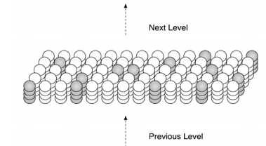

[HTM Learning Algorithm](http://numenta.org/resources/HTM_CorticalLearningAlgorithms.pdf)

[One Hot Gym tutorial](https://github.com/numenta/nupic/tree/master/examples/opf/clients/hotgym/anomaly/one_gym)

[Swarming Algorithm](https://github.com/numenta/nupic/wiki/Swarming-Algorithm)

[Running Swarms](https://github.com/numenta/nupic/wiki/Running-Swarms)

## Chapter 1: Introduction

### Architecture

Like a biological system, the learning algorithms in an HTML region are capable of 'on-line learning', i.e, they continually learn from each new input. 

*Time* plays a dominant role. Just like humans learn patterns from sequential information streams. 

### Computational Benefits

##### Less Memory & Time

<u>Knowledge reuse / inheritance:</u> patterns at each level of the hierarchy are reused when combined in novel ways at higher levels. Just like brain don't have to relearn what 'red' is in order to recognize a red apple. 

##### Dynamic/Adaptable Architecture:

When less memory is allocated at each level (each level possesses fewer knowledge), the number of levels leverages. The vice versa is similar. 

### Region

A specialized level in HTM architecture. Each region is layout in a 'matrix' fashion, where cells are divided in smaller layers and cells are highly <u>interconnected</u>. It is conceptually  equivalent to a portion of neocortical region. 

### Sparse Distributed Representations

**Sparse** : Only a small percentage of neurons are active at one time, while others are inhibited.

**Distributed**: activations of many neurons are required in order to represent something. 

## Chapter 2: HTM Cortical Learning Algorithms

### Terminology

* **Cell States**: feed-forward input + lateral input (from other cells' prediction) + inactive.
* **Dendrite Segments**: 
  * feed-forward input <=> received by proximal dendrite segment; lateral input <=> received by distal dendrite segment. 
  * shared dendrite segment <=> operated by spatial pooler function; distal dendrite segment <=> operated by temporal pooler function. 
* **Synapses**: WTF?

### Steps In Concrete

###### (1) Form a sparse distributed representation of the input <== Spatial Pooler

* Recall the idea of sparse (only some neurons are activated) . 
* Each column is connected to a *UNIQUE* subset of the input bits.
* Inhibition function tries to achieve a relatively constant percentage of *COLUMNS* to be active.
* Patterns that are 'spatially' similar are 'pooled'

###### (2) Form a representation of the input in the context of previous inputs

* A new representation that includes state, or *context*, from the *PAST*. 
* A same input (e.g, 'ate' and 'eight' both sound identical) can be represented differently depending on the context (e.g, 'I ate' and 'I have eight') by *<u>selecting a subset of cells to be activated for each column in activation</u>*. 
* If there is not prior state (no context or prediction), all the cells in a activated column will become active, i.e, there is no clue as to what it should be so all options are possible.

###### (3) Form a prediction based on the current input in the context of previous inputs

