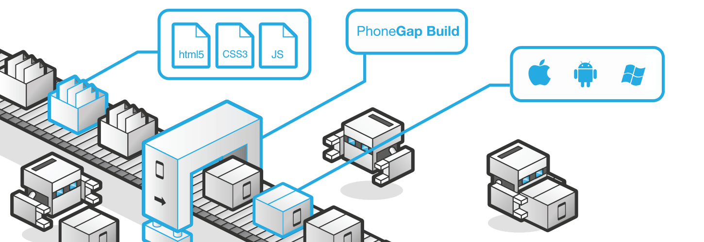
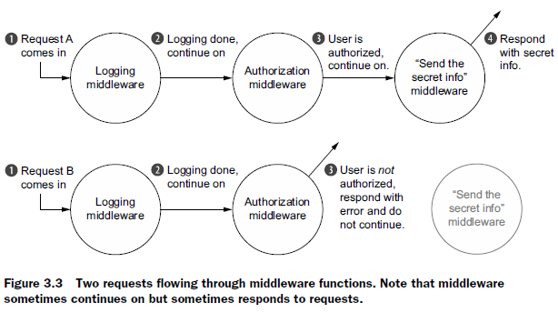

## Node.JS - Express.JS In Action

> *Nearly every bit of code in this book is either a request handler function or a way to call one ...* 


### Chapter 1 -3 . Basics of NodeJS and ExpressJS


#### What is this Node.JS Bussiness?

**Node.JS is:**

* **<u>*A runtime platform that operates on V8 Javascript engine*</u>** ( But it is not a framework!!! )
* It complements JavaScript with many backend capabilities, such as IO, File System ... 

**Why Node.JS**:

* How cool it is to have just one programming language from the frontend to backend ::smiley:!!!
* It is blazing fast :D. V8 is an awesome engine. 
* It runs JavaScript which naturally supports **<u>*Async Programming*</u>** and hence handles **<u>*concurrency*</u>** nicely and easily. It makes programming easier since you don't have to mangle multi-threads. The server is just faithfully just serving requests and doing messenger work :smiley:


#### What is Express.JS?

>  Express is an abstraction layer on top of Node's built-in HTTP server

The native NodeJS APIs are powerful but can get cumbersome to use to build a large application. ExpressJS came to light just like the jQuery to native Javascript :D. NodeJS leverages the notion of '<u>Event Loop'</u>, where all events are reported and corresponding event handlers (defined by the programmer) are invoked to do something, like this: 

```javascript
let http = require('http')
function requestHandler(request, response) {
 if (req.url === '/') { /* ... */ }
 else if (req.url === '/about') { /* ... */ }
 /* MAD */
}
let server = http.createServer(requestHandler);
server.listen(3000, () => console.log('Listening to PORT 3000'));
```

BUT IT IS CRAZY TO WRITE EVERYTHING IN ONE GIANT REQUEST HANDLER! 

Express come to rescue! 


#### The Four Features of ExpressJS

**Middleware**

> Just like an assembly line

It makes it possible to split the monster request handler into smaller handlers lined up in a sequence. Now you can treat the request/response as the toy on an assembly line , where workers (middleware) along the side adds widgets to it. Imagine you have many of the processers depicted below in a line ... 




<u>*Code and a real-world example*</u>

```javascript
let express = require('express');
let http = require('http');
let app = express();
// You can add another middleware at the front to make a middleware stack!
// Middleware chooses to or not to change the shape of request object before passing it to the colleague. 
app.use((req, res) => {/* ohoh this is very neat! */ });
http.createServer(app).listen(3000);
```




**Routing**: 

Routing is a way to map requests to specific handlers depending on their URL and HTTP verb. This is rather a simple concept but there are a couple of things to keep in mind:

* Use [router ](http://expressjs.com/en/4x/api.html#router) when the app is growing big. express.
* Basic syntax:  **<u>*app.METHOD(path, [callback, ...] callback)*</u>**, where callback can be a middleware function or an array of middleware functions. So you can chain the handlers for a route, for instance, calls login code after the user has successfully signed up. 


**Extensions to request and response objects**

Express already adds some useful methods to the req/res payload, such as *redirect* , *sendFile*, *ip, status,* and many more

This is what the third party middleware usually do to decorate your app, such as PassportJS adds logout to response for you. 


**Views**

If your server is not 100% an API server, you will need to write views :D (something I dislike ... ).  There are many template engines to choose and it's easy to set it up like this.

```javascript
app.set('views', path.resolve(__dirname, 'views'));
app.set('view engine', 'ejs' /* engine name*/)
```

**EJS:** a simple tinplating language. But I find it really really awkward to have brackets 'implanted' in HTML tags...

**Pug** ( previously named Jade ): kinda like a Python  style template engine... It stands out the template layout quite nicely and reduces typing dramatically, but rather hard to translate a vanilla HTML to Pug template.   So it is a cool language, but think twice before you made your mind to use it!

------


### Chapter 4 - 7: Core

TODO...

-----


### Chapter 10: Security

A list of security issues or error-prone situations you should take care of: 

1. <u>**Perilous parsing of query strings ( 10.2.3 )**</u>:
   * The value of the query key that appears twice will be parsed into an array, and will be string if otherwise ... 
   * So treat it as array by default!
2. **<u>Using HTTPS</u>**:
   * It is so important that you should enforce users to send HTTPS requests. Use <u>express-enforces-ssl</u> to do this
   * Tell users to stay on HTTPS by using HSTS. Use <u>Halmet</u> to do this
3. <u>**Preventing XSS**</u>:
   * **SANITISZE** user input to invalid executable code. 
   * Set X-XSS-Protection header to prevent reflected XSS (don't let the browser to execute what is in the url )
   * Also check out this useful HTTP widget called Content-Security-Policy
4. **<u>Preventing CSRF</u>**:
   * Set & Check CSRF token to make sure every request is sent from authenticated source. Use <u>csurf</u> middleware to do this.
5. **<u>Handling server crashes</u>**:
   * Use <u>Forever-CLI</u> to serve your code. Forever helps auto-restart the server once it's down. 
6. <u>**Hide your server**</u>:


* Stop Express publicizing itself by disable the X-Powered-By header
* Again, use Helmet ( this package really worth a try :D it makes it easy to config HTTP options )


#### Questions:

Pg133: why setting {extended: false} in bodyParser makes parsing simpler and more secure???

Pg133: which way is better for handling user authentication ?

1. Use password ?
2. Send an access token in header and verifies that manually in backend ?


#### Good Links

[Translation from SQL Terminology to Mongo Terminology](http://docs.mongodb.org/manual/reference/sql-comparison/index.html)

